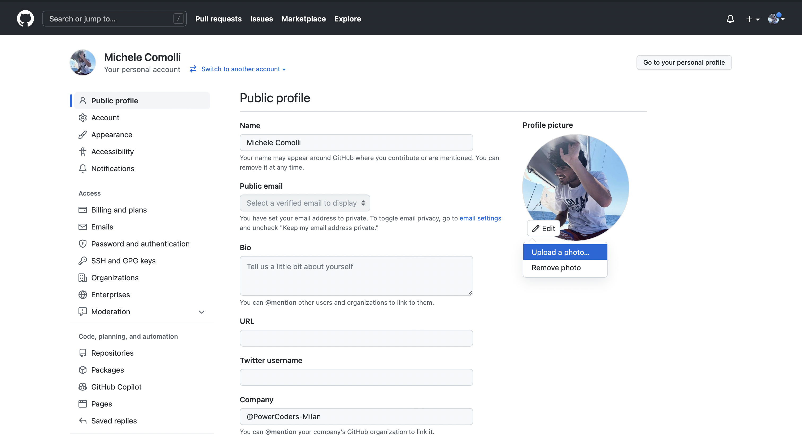

# Setup instructions

You will find below the instructions to set up you computer for [Powercoder Web Development Bootcamp](https://powercoders.org/country/italy/).

Please **read them carefully and execute all commands in the following order**.

If you get stuck, don't hesitate to ask a teacher for help :raising_hand:

Let's start :rocket:


## Zoom

To be able to interact when we are not in the same physical room, we will be using [Zoom](https://zoom.us/), a video conferencing tool.

:warning: If you already have Zoom installed, please make sure that the version is at least **5.6**.

Go to [zoom.us/download](https://zoom.us/download).

Under **Zoom Client** click the **Download** button.

Open the file you have just downloaded to install the app.

Open the Zoom app.

If you already have a Zoom account, sign in using your credentials.

If not, click on the **Sign Up Free** link:


You will be redirected to Zoom's website to complete a form.

When it's done, go back to the Zoom app and sign in using your credentials.

You should then see a screen like this:


You can now close the Zoom app.


## GitHub account

Have you signed up to GitHub? If not, [do it right away](https://github.com/join).

:point_right: **[Upload a picture](https://github.com/settings/profile)** and put your name correctly on your GitHub account. This is important as we'll use an internal dashboard with your avatar. Please do this **now**, before you continue with this guide.




## Visual Studio Code

### Installation

Let's install [Visual Studio Code](https://code.visualstudio.com) text editor.

Copy (`Ctrl` + `C`) the commands below then paste them in your terminal (`Ctrl` + `Shift` + `v`):

```bash
wget -qO- https://packages.microsoft.com/keys/microsoft.asc | gpg --dearmor > packages.microsoft.gpg
sudo install -o root -g root -m 644 packages.microsoft.gpg /etc/apt/trusted.gpg.d/
sudo sh -c 'echo "deb [arch=amd64,arm64,armhf signed-by=/etc/apt/trusted.gpg.d/packages.microsoft.gpg] https://packages.microsoft.com/repos/code stable main" > /etc/apt/sources.list.d/vscode.list'
rm -f packages.microsoft.gpg
sudo apt update
sudo apt install -y code
```

These commands will ask for your password: type it in.

:warning: When you type your password, nothing will show up on the screen, **that's normal**. This is a security feature to mask not only your password as a whole but also its length. Just type in your password and when you're done, press `Enter`.

### Launching from the terminal

Now let's launch VS Code from **the terminal**:

```bash
code
```

:heavy_check_mark: If a VS Code window has just opened, you're good to go :+1:

:x: Otherwise, please **contact a teacher**


## VS Code Extensions

### Installation

Let's install some useful extensions to VS Code.

Copy-paste the following commands in your terminal:

```bash
code --install-extension ms-vscode.sublime-keybindings
code --install-extension emmanuelbeziat.vscode-great-icons
code --install-extension github.github-vscode-theme
code --install-extension MS-vsliveshare.vsliveshare
code --install-extension dbaeumer.vscode-eslint
code --install-extension Rubymaniac.vscode-paste-and-indent
code --install-extension alexcvzz.vscode-sqlite
```

Here is a list of the extensions you are installing:
- [Sublime Text Keymap and Settings Importer](https://marketplace.visualstudio.com/items?itemName=ms-vscode.sublime-keybindings)
- [VSCode Great Icons](https://marketplace.visualstudio.com/items?itemName=emmanuelbeziat.vscode-great-icons)
- [Live Share](https://marketplace.visualstudio.com/items?itemName=MS-vsliveshare.vsliveshare)
- [ESLint](https://marketplace.visualstudio.com/items?itemName=dbaeumer.vscode-eslint)
- [Paste and Indent](https://marketplace.visualstudio.com/items?itemName=Rubymaniac.vscode-paste-and-indent)
- [SQLite](https://marketplace.visualstudio.com/items?itemName=alexcvzz.vscode-sqlite)


### Live Share configuration

[Visual Studio Live Share](https://visualstudio.microsoft.com/services/live-share/) is a VS Code extension which allows you to share the code in your text editor for debugging and pair-programming: let's set it up!

Launch VS Code from your terminal by typing `code` and pressing `Enter`.

Click on the little arrow at the bottom of the left bar :point_down:

- Click on the "Share" button, then on "GitHub (Sign in using GitHub account)".
- A popup appears asking you to sign in with GitHub: click on "Allow".
- You are redirected to a GitHub page in you browser asking you to authorize Visual Studio Code: click on "Continue" then "Authorize github".
- VS Code may display additional pop-ups: close them by clicking "OK".

That's it, you're good to go!


## Command line tools

### Zsh & Git

Instead of using the default `bash` [shell](https://en.wikipedia.org/wiki/Shell_(computing)), we will use `zsh`.

We will also use [`git`](https://git-scm.com/), a command line software used for version control.

Let's install them, along with other useful tools:
- Open an **Ubuntu terminal**
- Copy and paste the following commands:

```bash
sudo apt update
```

```bash
sudo apt install -y curl git imagemagick jq unzip vim zsh
```

These commands will ask for your password: type it in.

:warning: When you type your password, nothing will show up on the screen, **that's normal**. This is a security feature to mask not only your password as a whole but also its length. Just type in your password and when you're done, press `Enter`.

### GitHub CLI installation

Let's now install [GitHub official CLI](https://cli.github.com) (Command Line Interface). It's a software used to interact with your GitHub account via the command line.

In your terminal, copy-paste the following commands and type in your password if asked:

```bash
sudo apt remove -y gitsome # gh command can conflict with gitsome if already installed
curl -fsSL https://cli.github.com/packages/githubcli-archive-keyring.gpg | sudo dd of=/usr/share/keyrings/githubcli-archive-keyring.gpg
echo "deb [arch=$(dpkg --print-architecture) signed-by=/usr/share/keyrings/githubcli-archive-keyring.gpg] https://cli.github.com/packages stable main" | sudo tee /etc/apt/sources.list.d/github-cli.list > /dev/null
sudo apt update
sudo apt install -y gh
```

To check that `gh` has been successfully installed on your machine, you can run:

```bash
gh --version
```

:heavy_check_mark: If you see `gh version X.Y.Z (YYYY-MM-DD)`, you're good to go :+1:

:x: Otherwise, please **contact a teacher**


## Oh-my-zsh

Let's install the `zsh` plugin [Oh My Zsh](https://ohmyz.sh/).

In a terminal execute the following command:

```bash
sh -c "$(curl -fsSL https://raw.github.com/ohmyzsh/ohmyzsh/master/tools/install.sh)"
```

If asked "Do you want to change your default shell to zsh?", press `Y`

At the end your terminal should look like this:


:heavy_check_mark: If it does, you can continue :+1:

:x: Otherwise, please **ask for a teacher**


## GitHub CLI

CLI is the acronym of [Command-line Interface](https://en.wikipedia.org/wiki/Command-line_interface).

In this section, we will use [GitHub CLI](https://cli.github.com/) to interact with GitHub directly from the terminal.

It should already be installed on your computer from the previous commands.

First in order to **login**, copy-paste the following command in your terminal:

:warning: **DO NOT edit the `email`**

```bash
gh auth login -s 'user:email' -w
```

gh will ask you few questions:

`What is your preferred protocol for Git operations?` With the arrows, choose `SSH` and press `Enter`. SSH is a protocol to log in using SSH keys instead of the well known username/password pair.

`Generate a new SSH key to add to your GitHub account?` Press `Enter` to ask gh to generate the SSH keys for you.

If you already have SSH keys, you will see instead `Upload your SSH public key to your GitHub account?` With the arrows, select your public key file path and press `Enter`.

`Enter a passphrase for your new SSH key (Optional)`. Type something you want and that you'll remember. It's a password to protect your private key stored on your hard drive. Then press `Enter`.

:warning: When you type your passphrase, nothing will show up on the screen, **that's normal**. This is a security feature to mask not only your passphrase as a whole but also its length. Just type your passphrase and when you're done, press `Enter`.

You will then get the following output:

```bash
! First copy your one-time code: 0EF9-D015
- Press Enter to open github.com in your browser...
```

Select and copy the code (`0EF9-D015` in the example), then press `Enter`.

Your browser will open and ask you to authorize GitHub CLI to use your GitHub account. Accept and wait a bit.

Come back to the terminal, press `Enter` again, and that's it.

To check that you are properly connected, type:

```bash
gh auth status
```

:heavy_check_mark: If you get `Logged in to github.com as <YOUR USERNAME> `, then all good :+1:

:x: If not, **contact a teacher**.


## Add Zsh Plugins

Open windows terminal (check that you're in a ubuntu environment)

Run the following commands:

```bash
git clone https://github.com/zsh-users/zsh-autosuggestions ${ZSH_CUSTOM:-~/.oh-my-zsh/custom}/plugins/zsh-autosuggestions
git clone https://github.com/zsh-users/zsh-syntax-highlighting.git ${ZSH_CUSTOM:-~/.oh-my-zsh/custom}/plugins/zsh-syntax-highlighting
```

### Disable SSH passphrase prompt

You don't want to be asked for your passphrase every time you communicate with a distant repository. So, you need to add the plugin `ssh-agent` to `oh my zsh`:

First, open the `.zshrc` file:

```bash
code ~/.zshrc
```

Then:
- Spot the line starting with `plugins=`
- Add `ssh-agent` at the end of the plugins list

The list should look like:

```bash
plugins=(gitfast last-working-dir common-aliases zsh-syntax-highlighting history-substring-search pyenv ssh-agent)
```

:heavy_check_mark: Save the `.zshrc` file with `Ctrl` + `S` and close your text editor.


## Node.js

[Node.js](https://nodejs.org/en/) is a JavaScript runtime to execute JavaScript code in the terminal. Let's install it with [nvm](https://github.com/nvm-sh/nvm), a version manager for Node.js.

In a terminal, execute the following commands:

```bash
curl -o- https://raw.githubusercontent.com/nvm-sh/nvm/v0.39.1/install.sh | zsh
exec zsh
```

Then run the following command:

```bash
nvm -v
```

You should see a version. If not, ask a teacher.

Now let's install node:

```bash
nvm install 16.15.1
```

When the installation is finished, run:

```bash
node -v
```

If you see `v16.15.1`, the installation succeeded :heavy_check_mark: You can then run:

```bash
nvm cache clear
```

:x: If not, **contact a teacher**


## yarn

[`yarn`](https://yarnpkg.com/) is a package manager to install JavaScript libraries. Let's install it:

In a terminal, run the following commands:

```bash
npm install --global yarn
exec zsh
```

Then run the following command:

```bash
yarn -v
```

:heavy_check_mark: If you see a version, you're good :+1:

:x: If not, **ask for a teacher**


## SQLite

In a few weeks, we'll talk about databases and SQL. [SQLite](https://sqlite.org/index.html) is a database engine used to execute SQL queries on single-file databases. Let's install it:

In a terminal, execute the following commands:

```bash
sudo apt-get install sqlite3 libsqlite3-dev
```

Then run the following command:

```bash
sqlite3 -version
```

:heavy_check_mark: If you see a version, you're good :+1:

:x: If not, **ask for a teacher**


## PostgreSQL

Sometimes, SQLite is not enough and we will need a more advanced tool called [PostgreSQL](https://www.postgresql.org/), an open-source robust and production-ready database system.

Let's install it now.

Run the following commands:

```bash
sudo apt install -y postgresql postgresql-contrib libpq-dev build-essential
```

```bash
sudo -u postgres psql --command "CREATE ROLE \"`whoami`\" LOGIN createdb superuser;"
```


## Dashborard

Great you almost completed the setup! Now it's time to sign-up into your dashboard.

:warning: before proceeding, be sure you have a github account. :warning:

Open this webpage https://poco-dashboard.herokuapp.com , you'll see a central white button. Click on *sign in with github*


After that will be redirected to your `personal page` and you should se your avatar on the right.

In this page you'll be able to see your daily progress in the exercises.

## WeSchool

It's our platform to see all the content of bootcamp and videos of the lectures.
The link will be shared on Slack at the end of the day :) 

## Slack

[Slack](https://slack.com/) is a communcation platform pretty popular in the tech industry.

### Installation

[Download the Slack app](https://get.slack.help/hc/en-us/articles/212924728-Slack-for-Linux-beta-) and install it.

:warning: If you are already using Slack in your browser, please download and install **the desktop app** which is fully featured.


### Settings

Launch the app and sign in to `powercoders` organization.

Make sure you **upload a profile picture** :camera_with_flash:

The idea is that you'll have Slack open all day, so that you can share useful links / ask for help / decide where to go to lunch / etc.

To ensure that everything is working fine for video calls, let's test your camera and microphone:
- Open the Slack app
- In any channel message bar type `/call --test` and press `Enter`
- Click on the "Start test" green button


:heavy_check_mark: When the test is finished, you should see green "Succeed" messages at least for your microphone and camera. :+1:

:x: If not, **contact a teacher**.

You can also install Slack app on your phone and sign in `powercoders`!


## Ubuntu settings

### Install video codec H264

On our pedagogical platform we have some videos. By default Firefox on Linux cannot play them as they use an unsupported codec (H264). To get those videos working for you, you need to run this:

```bash
sudo apt install libavcodec-extra -y
```

### Install useful terminal tools

`tree` is a nice tool to visualize a directory tree inside the terminal:

`ncdu` is a text-based interface disk utility.

`htop` is an interactive process viewer.

`tig` is a text-mode interface for `git`.

```bash
sudo apt install tree ncdu htop tig
```

### Ubuntu inotify

Ubuntu is always tracking changes in your folders and to do this it uses inotify.
By default the Ubuntu limit is set to 8192 files monitored.

As programming involves a lot of files, we need to raise this limit.
In your terminal run:

```bash
echo fs.inotify.max_user_watches=524288 | sudo tee -a /etc/sysctl.conf && sudo sysctl -p
```

### Pin apps to your dock

You are going to use most of the apps you've installed today really often. So let's pin them to your dock so that they are just one click away!

To pin an app to your dock, launch the app, right-click on the icon in the dock to bring up the context menu and choose "Add to Favorites".


You must pin:
- Your terminal
- Your file explorer
- VS Code
- Your Internet browser
- Slack
- Zoom


## Setup completed!

Your computer is now all set for [Powercoders Web Development course](https://powercoders.org/country/italy/) :muscle: :clap:

Enjoy the bootcamp, you will nail it :rocket:

